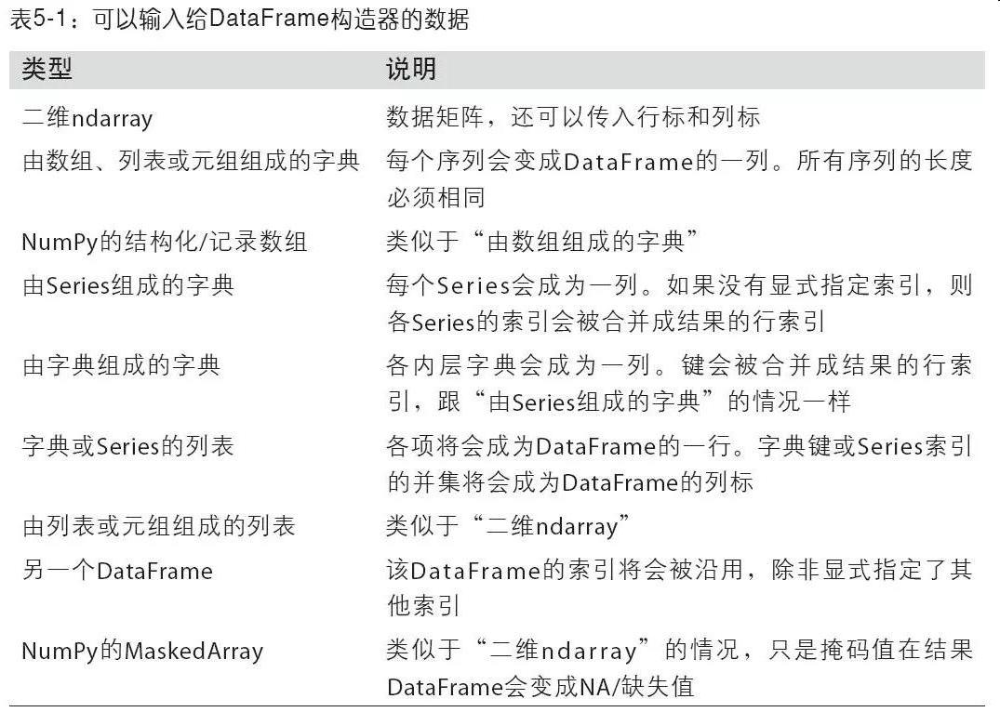
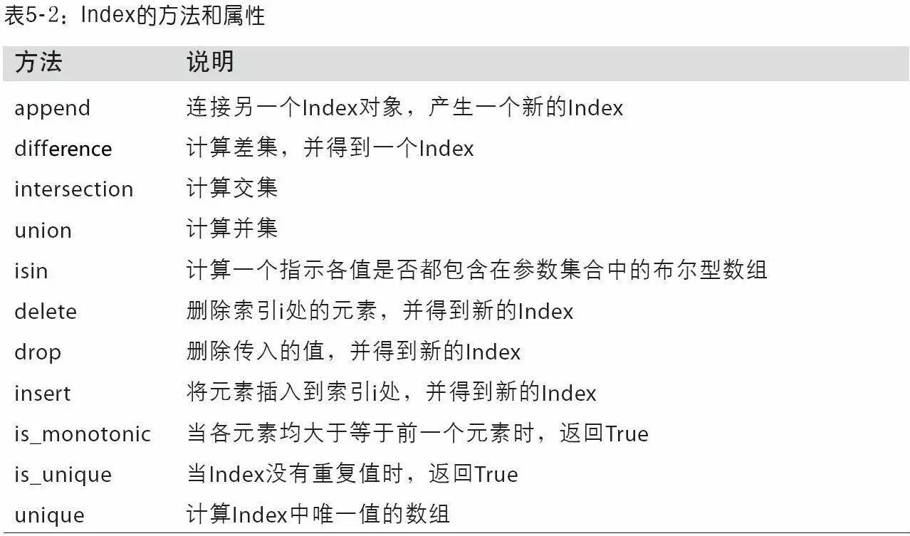

```python
import pandas as pd
from pandas import Series, DataFrame
import numpy as np
```

# 5.1 pandas的数据结构介绍

## 5.1.1 Series

### 创建


```python
# 创建
s1 = pd.Series([1, 2, -4, 5])
```


```python
# 指定index创建
s2 = pd.Series([1, 2, -4, 5], index = ['a', 'b', 'd', 's'], name='s2')
```


```python
# 使用字典创建时，会按照key排序??这里运行结果没有排序，还是sdata中的与原顺序，跟书不一样！！
sdata = {'Ohio': 35000, 'Texas': 71000, 'Oregon': 16000, 'Utah': 5000}
s3 = pd.Series(sdata)
s3
```


```python
# 当传入的index里面的值跟sdata的keys不一样时，以index为准，sdata没有的填NaN，sdata多余的丢弃
states = ['California', 'Ohio', 'Oregon', 'Texas']
s4 = pd.Series(sdata, index=states)
s4
```

### 取值赋值


```python
# 取values和index
s2.values, s2.index
```


```python
# 修改name
s2.name = 's2_new'
s2.index.name = 's2_index'
s2
```


```python
# 修改index
s2.index = ['x', 'y', 'z', 't']
s2
```


```python
# 取单个值，注意不能用.取值，只能用[]
s2['x']
# list取值
s2[['x', 'y']]
# 赋值
s2['t'] = 10
# list赋值
s2[['x', 'y']] = [3, 4]
s2
```

### 运算


```python
# bool数组索引
s2[s2 > 0]
```


```python
# 元素级的运算
s2 * 2
```


```python
# 应用numpy函数
np.exp(s2)
```


```python
# 元素级加法时，会自动对齐，Nan会传播
s3 + s4
```

### 判断空，存在性


```python
# 将Series当做固定长度有序的dict，可以使用in
'a' in s2
```


```python
# 判断非空,问题: isna和isnull的区别?
pd.isnull(s2), pd.notnull(s2)
```


```python
# 使用实例方法
s2.isnull(), s2.notnull()
```

## 5.1.2 DataFrame

###  创建


```python
# 等长list的dict创建
data = {'state': ['Ohio', 'Ohio', 'Ohio', 'Nevada', 'Nevada', 'Nevada'],
        'year': [2000, 2001, 2002, 2001, 2002, 2003],
        'pop': [1.5, 1.7, 3.6, 2.4, 2.9, 3.2]}
df1 = pd.DataFrame(data)
```


```python
# 指定columns和index
df2 = pd.DataFrame(data, columns=['pop', 'state', 'year', 'empty1', '1'], index = range(3, 9))
df2
```


```python
# 使用嵌套字典创建，外层为列名，内层为index，index会重新排序
pop = {'Ohio': {2002: 2.4, 2001: 2.9}, 'Nevada': {2002: 1.5, 2001: 1.7, 2000: 3.6}}
df3 = pd.DataFrame(pop)
df3
```


```python
# 指定index以后不会重新排序
# 照抄书居然会报错：'list' object has no attribute 'astype'
# 嵌套字典初始化时不再支持指定index？
# pop = {'Nevada': {2001: 2.4, 2002: 2.9}, 'Ohio': {2000: 1.5, 2001: 1.7, 2002: 3.6}}
# df4 = pd.DataFrame(pop, index = [2001, 2002, 2003])
# df4
```


```python
# Series的字典来构造
pdata = {'Ohio': df3['Ohio'][:-1], 'Nevada': df3['Nevada'][:2]}
df5 = pd.DataFrame(pdata)
df5
```

表5-2 构造DataFrame的方法


### 取值赋值


```python
# 取前几行
df2.head(3)
```


```python
# 取columns
df2.columns
# 取index
df2.index
```


```python
# values返回一个二维的ndarray
df2.values
```


```python
# 修改name
# df2本身没有name属性
df2.index.name = 'df2_index'
df2.columns.name = 'df2_columns'
df2
```


```python
# []取值，取列，返回一个相同index的Series，并且本身的name和index的name已经设置好
df2['pop']
```


```python
# 用.取值，只有列名是合法的python变量名才能用这种方式，结果同[]取值
# 比如df2.1会报错，只能用df2['1']
df2.empty1
```


```python
# 使用loc加方括号取值，取某一行，
df2.loc[3]
```


```python
# 赋值，使用[]或者.赋值
# 赋值标量
df2['1'] = 5
# 赋值等长list、range对象、np.arange对象时，长度必须匹配
df2.empty1 = ['a1', 'a2', 'a3', 'a4', 'a5', 'a6']
df2.empty1 = range(6)
df2.empty1 = np.arange(6)
# 赋值Series对象时，会匹配index，多余的index忽视，不包含的填NaN
df2.empty1 = pd.Series([1, 2, 3, 4], index = [2, 3, 5, 10])
df2
```


```python
# 使用[]直接添加新的列
df2['eastern'] = df2.state == 'Ohio'
# 用.添加不能添加新列，不会报错，但不起作用
df2.c = 4
```


```python
# loc加[]同样可以对某一行赋值
df2.loc[3] = 5
```


```python
# loc加[]直接添加新的行
df2.loc['new_index'] = 3
df2
```


```python
# 删除某一列，可以用[],不能用.
del df2['empty1']
# 不能用loc删除行，报错：AttributeError: __delitem__
# 怎么删除一行？
# del df2.loc[3]
```

### 判断空、存在性、其他操作


```python
# empty操作，当行或者列是空的时候，empty为true
d = pd.DataFrame([], columns=['a', 'b'])
d1 = pd.DataFrame([], index = [1, 2])
d1.empty
```


```python
# 用in判断列名是否包含
'pop' in df2
```


```python
# 判断列或行是否包含
'pop' in df2.columns
5 in df2.index
```


```python
# 转置
df2.T
```

## 5.1.3 Index Objects（索引对象）


```python
# index可以当成序列使用，比如分片
index = s2.index
index[2:]
```


```python
# index是不可修改的，因为可以在不同的结构中共享index
labels = pd.Index(np.arange(3))
s = pd.Series([1, 3, 2.3], index = labels)
s.index is labels
```


```python
# index里面的元素可以重复
index2 = pd.Index(['a1', 'a1', 'a2'])
# 当选择a1时会把所有的都选出来
s = pd.Series([1, 2, 3], index = index2)
s['a1']
```

表5-2 index的方法和属性


# 5.2 基本功能

## 5.2.1 Reindexing


```python
ss
```
